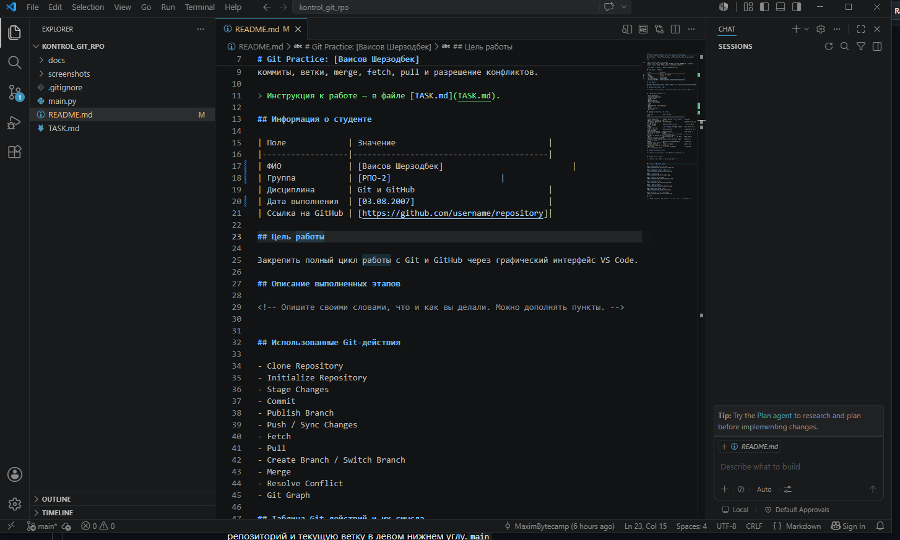
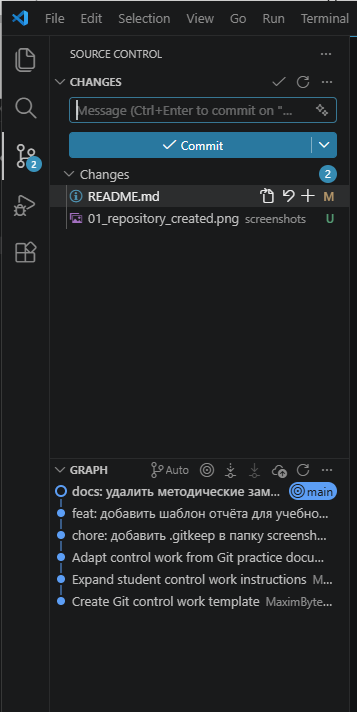
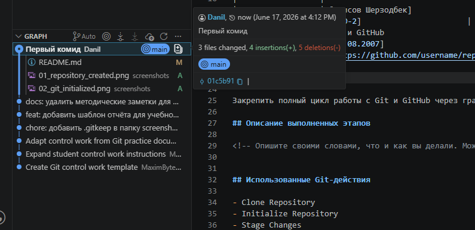
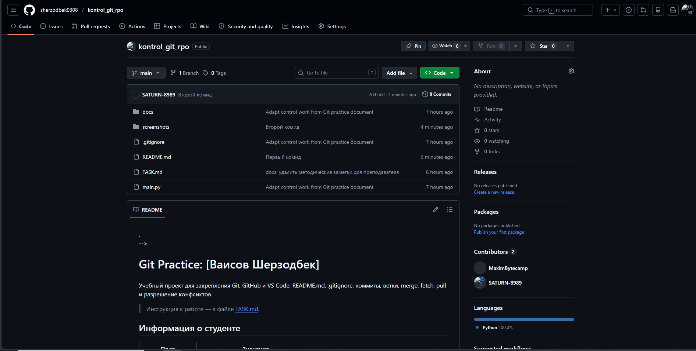
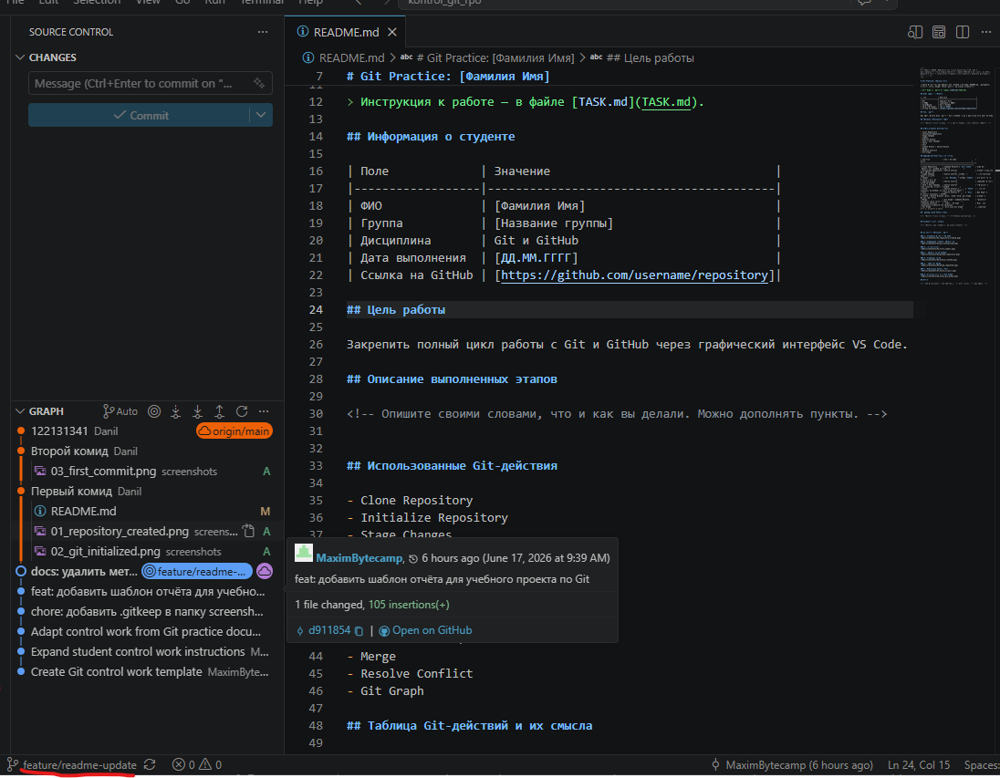
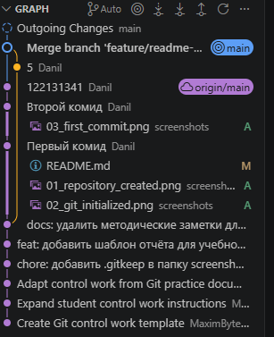
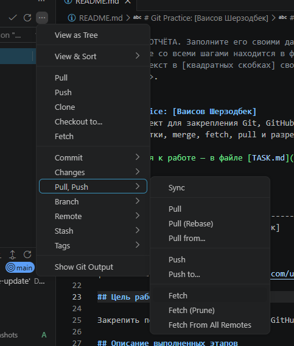
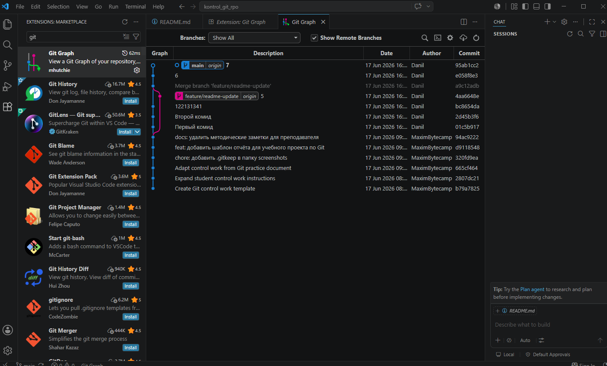

# Контрольная работа: Git, GitHub и VS Code

## Название проекта

Практическая работа с Git и GitHub через графический интерфейс VS Code.

## Цель контрольной работы

Закрепить практические навыки работы с локальным и удалённым Git-репозиторием через VS Code: клонирование проекта, инициализация репозитория, коммиты, публикация на GitHub, работа с ветками, merge, fetch, pull, `.gitignore`, Git Graph и оформление отчёта в Markdown.

## Стартовое задание

Вы получили шаблон проекта. Его нужно склонировать к себе на компьютер, продолжить работу локально и оформить результат в собственном GitHub-репозитории.

В работе запрещается выполнять основные Git-действия только через терминал. Основной способ выполнения: графический интерфейс VS Code:

- Source Control;
- Commit;
- Publish Branch;
- Push / Sync Changes;
- Fetch;
- Pull;
- Branch;
- Merge;
- Git Graph.

Терминал можно использовать только для запуска Python-файла и проверки работы программы.

## Что нужно сделать

1. Склонировать шаблон проекта из GitHub в отдельную папку на компьютере.
2. Открыть проект в VS Code.
3. Проверить наличие файлов:
   - `README.md`;
   - `.gitignore`;
   - `main.py`;
   - папка `screenshots/`.
4. Если преподаватель выдал пустую папку, создать новый проект самостоятельно и инициализировать Git через `Initialize Repository`.
5. Настроить `.gitignore`, чтобы в репозиторий не попадали:
   - `.env`;
   - `venv/`;
   - `__pycache__/`;
   - файлы с расширением `.log`.
6. Сделать первый осмысленный коммит через Source Control.
7. Опубликовать проект на GitHub через `Publish Branch`.
8. Создать отдельную ветку для новой функции.
9. В ветке изменить `main.py`: добавить новую функцию или улучшить существующую программу.
10. Сделать коммит в новой ветке.
11. Слить ветку в `main` через `Merge`.
12. Выполнить `Fetch` и `Pull`, показать или объяснить разницу между ними.
13. Смоделировать конфликт или подробно описать возможную ситуацию конфликта.
14. Описать способ решения конфликта в VS Code.
15. Добавить обязательные скриншоты в папку `screenshots/`.
16. Оформить этот `README.md` как отчёт по работе.
17. Отправить финальные изменения на GitHub через `Push` или `Sync Changes`.

## Требования к программе `main.py`

В файле `main.py` должна быть простая Python-программа. Можно использовать стартовый вариант из шаблона и доработать его.

Минимальные требования:

- программа запускается без ошибок;
- в программе есть минимум две функции;
- после работы в отдельной ветке добавлена новая возможность;
- код аккуратно оформлен и понятен.

Примеры новых функций:

- вывод списка выполненных этапов контрольной работы;
- подсчёт количества сделанных Git-действий;
- вывод информации об авторе работы;
- небольшое меню в консоли;
- сохранение короткого отчёта в текстовый файл, если файл не попадает под `.gitignore`.

## Выполненные этапы

Заполните этот раздел после выполнения работы.

1. Проект был склонирован из GitHub.
2. Проект был открыт в VS Code.
3. Репозиторий был проверен или инициализирован.
4. Были созданы или проверены файлы `README.md`, `.gitignore`, `main.py`.
5. Был настроен файл `.gitignore`.
6. Был создан первый коммит.
7. Репозиторий был опубликован на GitHub.
8. Была создана отдельная ветка.
9. В ветке были внесены изменения в программу.
10. Ветка была слита с `main`.
11. Были выполнены `Fetch` и/или `Pull`.
12. Был рассмотрен конфликт и способ его решения.
13. В отчёт были добавлены скриншоты.

## Использованные Git-действия

Отметьте действия, которые вы выполнили:

- [ ] Clone Repository
- [ ] Initialize Repository
- [ ] Stage Changes
- [ ] Commit
- [ ] Publish Branch
- [ ] Push
- [ ] Sync Changes
- [ ] Fetch
- [ ] Pull
- [ ] Create Branch
- [ ] Checkout / Switch Branch
- [ ] Merge Branch
- [ ] Resolve Conflict
- [ ] View Git Graph

## Таблица Git-действий

| Действие | Где выполнялось в VS Code | Смысл действия |
|---|---|---|
| Clone Repository | Command Palette или Source Control | Копирует удалённый репозиторий с GitHub на компьютер |
| Initialize Repository | Source Control | Создаёт новый локальный Git-репозиторий |
| Stage Changes | Source Control | Подготавливает выбранные изменения к коммиту |
| Commit | Source Control, поле Message | Сохраняет зафиксированную версию изменений в истории |
| Publish Branch | Source Control | Создаёт удалённый репозиторий или публикует ветку на GitHub |
| Push | Source Control | Отправляет локальные коммиты на GitHub |
| Sync Changes | Source Control | Выполняет обмен изменениями между локальным и удалённым репозиторием |
| Fetch | Source Control | Проверяет новые изменения на GitHub, но не применяет их к рабочим файлам |
| Pull | Source Control | Загружает изменения с GitHub и применяет их к текущей ветке |
| Create Branch | Нижняя панель VS Code или Git Graph | Создаёт новую ветку для отдельной задачи |
| Switch Branch | Нижняя панель VS Code или Git Graph | Переключает рабочую область на другую ветку |
| Merge | Git Graph или Command Palette | Объединяет изменения из одной ветки с другой |
| Resolve Conflict | Редактор VS Code | Позволяет выбрать нужный вариант при конфликте изменений |
| Git Graph | Расширение Git Graph | Показывает историю коммитов и веток в виде графа |

## Разница между Fetch и Pull

`Fetch` получает информацию о новых коммитах из удалённого репозитория, но не меняет файлы в рабочей папке.

`Pull` получает новые коммиты и сразу пытается применить их к текущей ветке.

Пример вывода для отчёта:

> Я использовал Fetch, чтобы проверить наличие новых изменений на GitHub. После Fetch мои локальные файлы не изменились. Затем я использовал Pull, чтобы загрузить и применить изменения в текущую ветку.

## Конфликт и его решение

Опишите смоделированный конфликт или возможную ситуацию:

> Конфликт может возникнуть, если один и тот же фрагмент файла был изменён в двух разных ветках или на двух разных компьютерах. Например, в ветке `main` была изменена строка приветствия в `main.py`, и в ветке `feature-info` эта же строка была изменена по-другому.

Опишите, как вы решили конфликт:

> В VS Code я открыл файл с конфликтом, сравнил варианты `Current Change` и `Incoming Change`, выбрал нужный вариант или объединил оба изменения, затем добавил исправленный файл в Stage и сделал коммит слияния.

## Скриншоты

Добавьте скриншоты в папку `screenshots/` и вставьте их в отчёт.

Обязательные файлы:

| Файл | Что должно быть на скриншоте |
|---|---|
| `01_repository_created.png` | Созданный или склонированный проект в VS Code |
| `02_git_initialized.png` | Инициализированный Git-репозиторий |
| `03_first_commit.png` | Первый коммит в Source Control или Git Graph |
| `04_github_repository.png` | Опубликованный репозиторий на GitHub |
| `05_branch_created.png` | Созданная отдельная ветка |
| `06_merge_completed.png` | Результат merge |
| `07_fetch_or_pull.png` | Выполнение Fetch или Pull |
| `08_final_git_graph.png` | Итоговая история в Git Graph |

Вставьте скриншоты ниже:

### 1. Созданный проект

### 2. Инициализированный репозиторий

### 3. Первый коммит

### 4. Репозиторий на GitHub

### 5. Созданная ветка

### 6. Выполненный merge

### 7. Fetch или Pull

### 8. Итоговая история Git Graph

## Критерии оценивания

| Критерий | Баллы |
|---|---:|
| Проект создан или склонирован, открыт в VS Code | 5 |
| Репозиторий корректно инициализирован | 5 |
| Файлы `README.md`, `.gitignore`, `main.py` созданы и оформлены | 10 |
| `.gitignore` настроен правильно | 10 |
| Есть несколько осмысленных коммитов | 15 |
| Репозиторий опубликован на GitHub | 10 |
| Создана отдельная ветка и выполнена работа в ней | 10 |
| Ветка слита в `main` через Merge | 10 |
| Показана или объяснена разница между Fetch и Pull | 10 |
| Описан конфликт и способ его решения | 10 |
| README оформлен как полноценный отчёт со скриншотами | 15 |
| **Итого** | **110** |

## Что сдавать

Сдайте преподавателю:

1. Ссылку на GitHub-репозиторий.
2. Готовый `README.md` с отчётом.
3. Папку `screenshots/` с обязательными скриншотами.
4. Финальную версию `main.py`.

